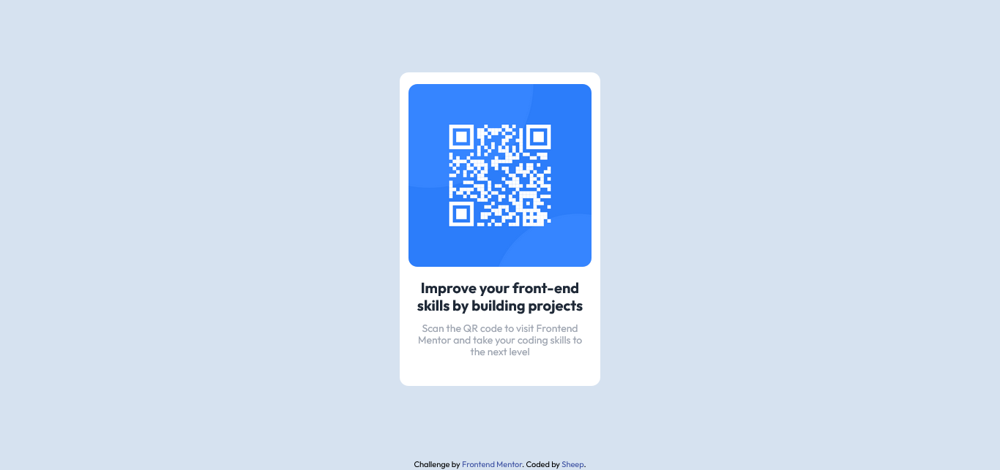

# Frontend Mentor - QR code component solution

This is a solution to the [QR code component challenge on Frontend Mentor](https://www.frontendmentor.io/challenges/qr-code-component-iux_sIO_H). Frontend Mentor challenges help you improve your coding skills by building realistic projects. 

## Table of contents

- [Overview](#overview)
  - [Screenshot](#screenshot)
  - [Links](#links)
- [My process](#my-process)
  - [Built with](#built-with)
  - [What I learned](#what-i-learned)

## Overview

### Screenshot




### Links

- Solution URL: [Github](https://github.com/ShaunDaniel/QR-Code-Component)
- Live Site URL: [Vercel](https://qr-code-component-five-dusky.vercel.app/)

## My process

### Built with

- HTML5
- TailwindCSS


### What I learned

I understood CSS sizing in Tailwind using h-[value] & w-[value].

It was fun to play around with different values to achieve the desired sizing for my divs.

Some examples:

```html
<div class="qr-code w-11/12 mt-4 ">
</div>
```
This was the code I implemented for the QR code image, I wanted the QR code to take up atleast 80-90% of the div so that it leaves a little space on each side.


